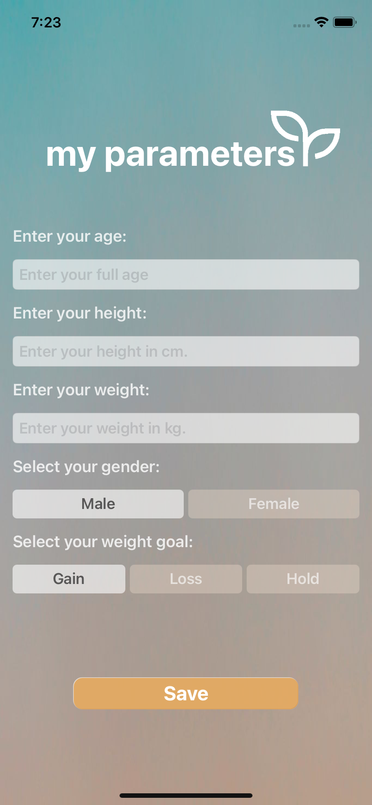
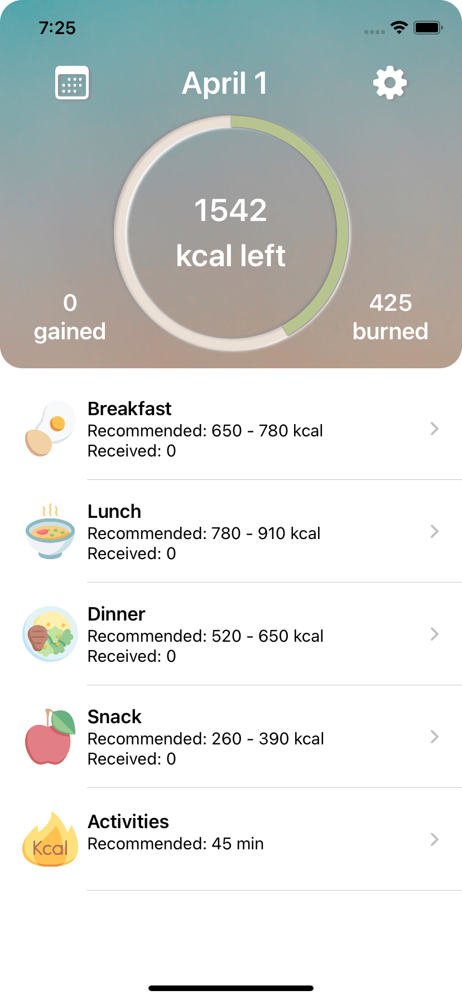
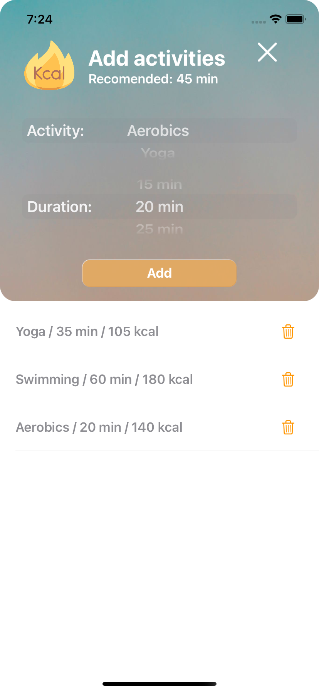
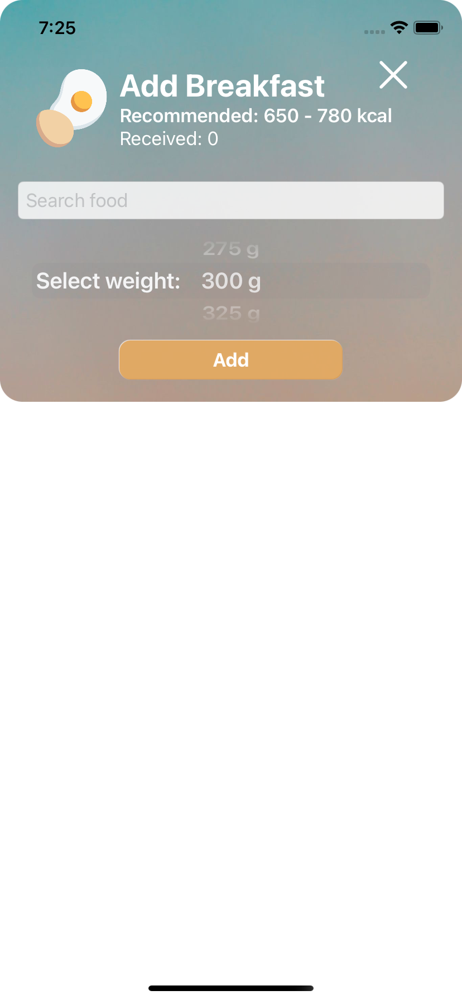

# DietDuo App

## A calories and activity counter with personalized recomendations depended on your goals:
- User preferences 
- Advanced calcucator with daily calories recomendations, with the logic I wrote
- Calculator of activities
- Personolized recomenation of calories for each meal
- ...work is in progress

## Stack used:
- SwiftUI
- Architecture: MVVM
- Combine observation features (@ObservableObjects/@Published etc.)
  

   
   
   
   

